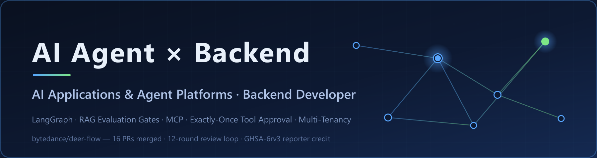

  

  
  
  
  
  
  
  
  
  
  
  
  
  
  

---

### 🧭 About Me

- **Backend developer focused on AI applications & Agent platforms** (undergraduate, class of 2028, available for internship)
- Currently building: Agent platform engineering — RAG evaluation gates, exactly-once tool approval, multi-channel agent workbench
- I believe in verifiable contributions: every number here matches the public record

### 📮 Contact

`kfeng.du@outlook.com` — resume & project details on request
